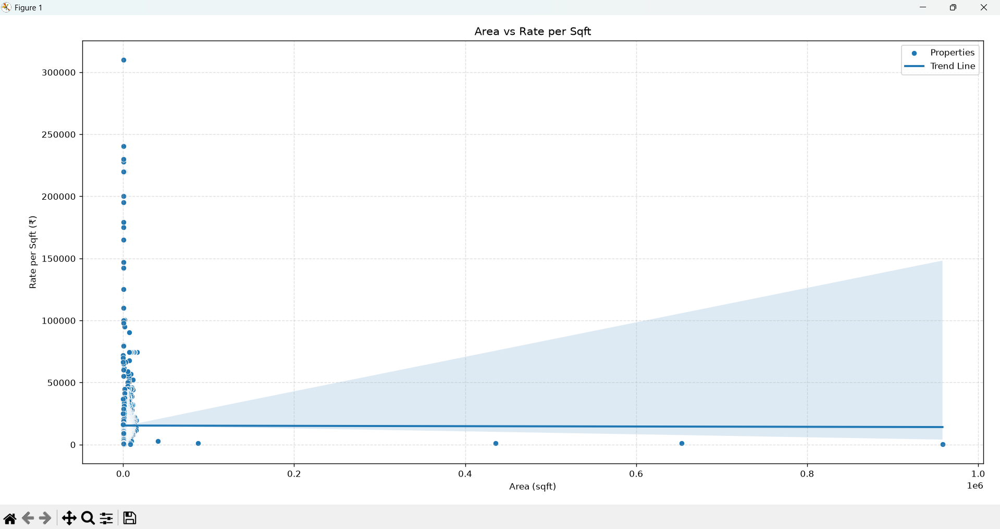

# Real Estate Data Analysis

A Python-based data analysis project exploring real estate property data using Pandas, NumPy, Matplotlib, and Seaborn.

The project analyzes property prices, area, price per square foot, locality, BHK configuration, property type, builders, and other factors to identify useful patterns and insights from the dataset.

## 📌 Project Overview

This project performs exploratory data analysis (EDA) on a real estate dataset.

The analysis focuses on questions such as:

- How does property area relate to property price?
- How does area relate to the rate per square foot?
- Which localities have the highest average property prices?
- Which localities have the highest average rate per square foot?
- How do ready-to-move-in and under-construction properties compare?
- Does RERA approval affect property prices?
- Which BHK configuration is the most expensive on average?
- Which property type has the highest average price?
- Which builders tend to list properties at higher prices?

## 🛠️ Technologies Used

- **Python**
- **Pandas** – Data manipulation and analysis
- **NumPy** – Numerical operations
- **Matplotlib** – Data visualization
- **Seaborn** – Statistical visualization

## 📊 Analysis & Visualizations

### Area vs Rate per Sqft

This visualization examines the relationship between property area and price per square foot, including a trend line.



## 🔍 Key Findings

Some of the findings from the analysis include:

- The costliest flat in the dataset is a **6 BHK** property located in **Sector 42**, priced at approximately **₹122.63 crores**.
- **Baliawas** has the highest average property price among the analyzed localities.
- **Sector 42** has the highest average rate per square foot.
- **Ready-to-move-in properties** cost more on average than under-construction properties.
- **RERA-approved properties** do not show a clear price premium in the analysis.
- The most expensive BHK configuration on average is **114 BHK**.
- **Villa** is the most expensive property type based on average price.
- The top builders identified as having higher-priced properties include **Camelliaass, Camelliaas, Tulip, Prom, and Magnoliaass**.

## 📁 Project Structure

```text
real-estate-data-analysis/
│
├── main.py
├── data.csv
├── README.md
├── area-vs-rate-per-sqft.png
└── analysis-output.png
