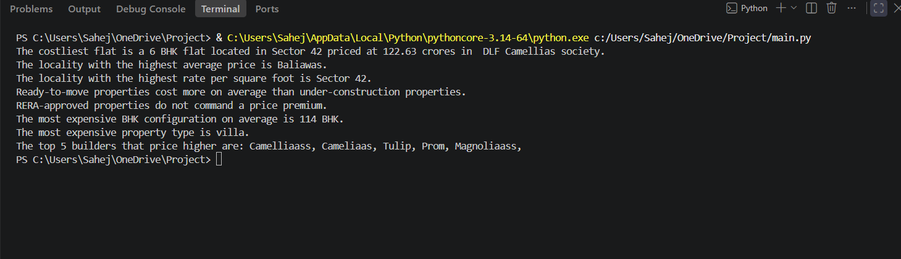

# 🏠 Real Estate Data Analysis

A Python-based data analysis project focused on exploring and understanding real estate property data.

The project uses **Python, Pandas, NumPy, and Matplotlib** to clean, analyze, and visualize property-related data and identify useful trends and insights.

---

## 📌 Project Overview

This project analyzes real estate property data to answer questions related to:

- Property prices
- Property area
- Price per square foot
- Localities
- BHK configurations
- Property types
- Builders
- RERA approval
- Under-construction vs ready-to-move properties

The analysis combines data cleaning, exploratory data analysis, statistical calculations, and visualization.

---

## 🛠️ Technologies Used

- **Python**
- **Pandas**
- **NumPy**
- **Matplotlib**
- **VS Code**
- **MySQL**

---

## 📂 Project Files

| File | Description |
|------|-------------|
| `main.py` | Python analysis and visualization code |
| `data.csv` | Real estate dataset |
| `analysis-output.png` | Screenshot of Python analysis results |
| `area-vs-rate.png` | Area vs Rate per Sqft visualization |
| `database-erd.png` | Database Entity Relationship Diagram |
| `sql-query-results.png` | Screenshot of SQL query results |
| `saheshop-ecommerce.sql` | SQL database and analysis queries |

---

## 📊 Python Analysis

The Python analysis provides insights such as:

- The costliest flat is a **6 BHK flat located in Sector 42**, priced at approximately **₹122.63 crores**.
- The locality with the highest average property price is **Baliawas**.
- **Sector 42** has the highest rate per square foot.
- Ready-to-move properties cost more on average than under-construction properties.
- RERA-approved properties do not show a price premium in the analyzed data.
- The most expensive BHK configuration on average is **114 BHK**.
- The most expensive property type on average is **Villa**.
- The top 5 builders with higher-priced properties are **Camelliaass, Camelliaas, Tulip, Prom, and Magnoliaass**.

### Analysis Output

---

## 📈 Data Visualization

The project also includes a visualization showing the relationship between property area and rate per square foot.

The graph includes individual property observations along with a trend line to help visualize the relationship between area and price per square foot.

---

## 🗄️ SQL Database

The SQL portion of the project demonstrates database design and analytical querying using an e-commerce dataset.

### Entity Relationship Diagram

The database relationships are represented using an Entity Relationship Diagram (ERD).

### SQL Query Results

The project includes multiple SQL queries covering:

- Total revenue
- Revenue by product
- Customer spending
- Product sales
- Cancelled orders
- Other business-oriented analysis

---

## 🎯 Key Skills Demonstrated

- Data cleaning and preprocessing
- Exploratory Data Analysis (EDA)
- Data aggregation and grouping
- Statistical analysis
- Data visualization
- SQL querying
- Database design
- Relational database concepts
- Business-oriented data analysis

---

## 👨‍💻 Author

**Sahej Malothra**
